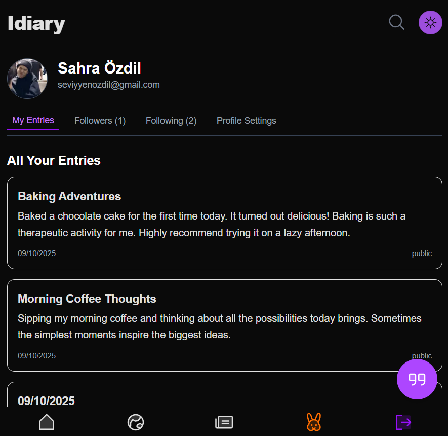
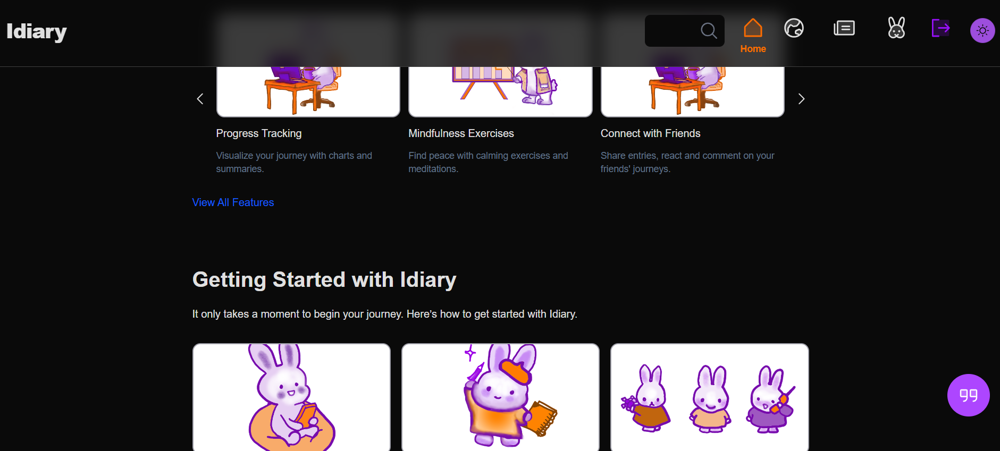

# Idiary App

**Idiary** is a personal diary web application built with Next.js and Firebase. Users can create, share, and explore diary entries in a social-style feed while maintaining control over privacy. Some features are still under development.

---

## Features

### ✅ Current Features

- **Create Diary Entries**
  - Users can post diary entries as **private** or **public**.

- **User Profiles**
  - View your own profile or search for other users.
  - See other users’ posts (public entries only).

- **Follow / Unfollow Users**
  - Users can follow or unfollow other users to customize their feed.

- **Feeds**
  - **Dashboard Feed:** Shows entries from users you follow.
  - **Global Feed:** Displays all public entries (not fully implemented yet).

- **Search Users**
  - Quickly search for other users and visit their profile pages.

- **Theme Toggle**
  - Switch between light and dark themes for better user experience.

---

### ⚠️ Limitations / In Development

- Liking or saving posts is **not implemented yet**.
- Some features in the global feed are **still under development**.
- Certain UI improvements (shadows, sticky header, mobile menu) are being polished.

---

## Usage

1. **Sign up / Log in** with your account.
2. **Post diary entries** (choose between private or public).
3. **Explore feeds**:
   - Global Feed (public entries)
   - Dashboard (followed users’ entries)
4. **Follow or unfollow users** to see their posts in your dashboard feed.
5. **Search for users** and view their profile and entries.
6. **Toggle theme** between light and dark mode for readability.

---

## Installation & Setup

1. **Clone the repository**

```bash
git clone <repo-url>
cd idiary-app
```

2. **Install dependencies**

```bash
npm install
```

3. **Run the development server**

```bash
npm run dev
```

4. **Code formatting**
   To format your code with Prettier, run:

```bash
npm run format
```

Make sure you have your Firebase environment variables set up before running the app.

## Contributing

- Features like like/save posts, global feed enhancements, and improved UI/UX are in progress.

- Contributions are welcome to help implement missing functionality.

## Screenshots




## Technologies Used

-Next.js
-React
-Firebase (Authentication, Firestore)
-Tailwind CSS
-Phosphor Icons
